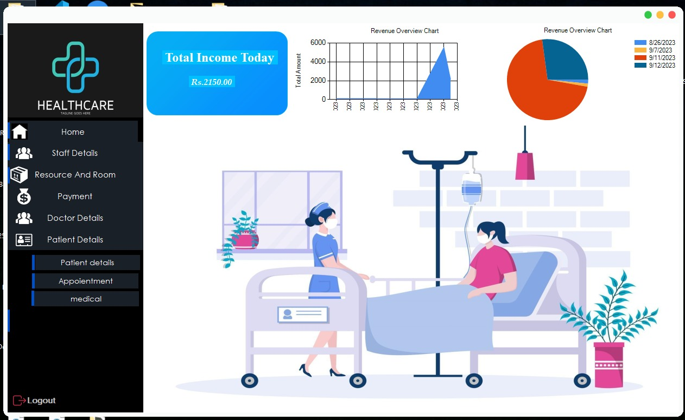
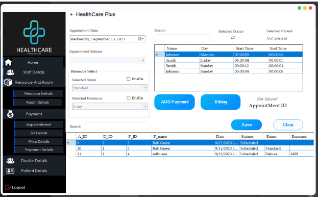
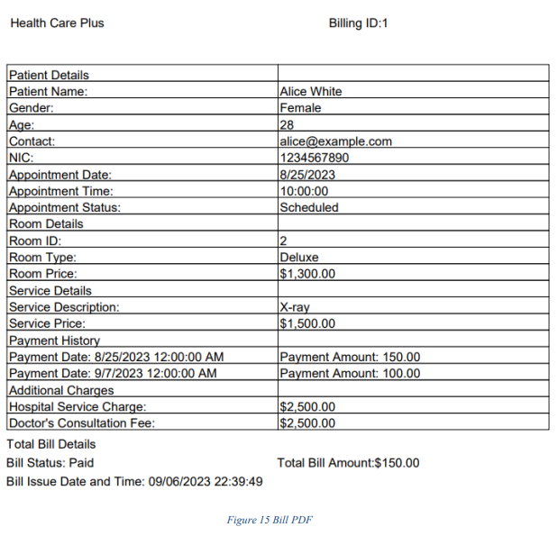
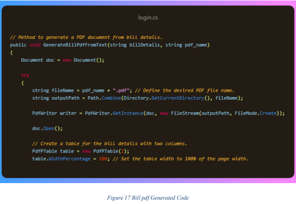
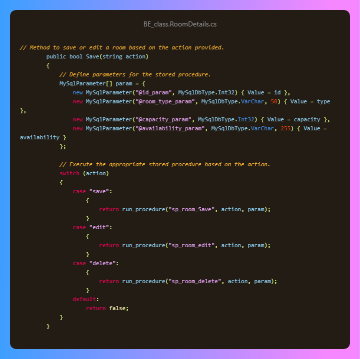

<div align="center">
    
</div>
  
<div align="center">
    <h1>HealthCare Plus - Healthcare Management System</h1>
</div>

## Project Overview

HealthCare Plus is a comprehensive Healthcare Management System designed to streamline and enhance healthcare services. This project aims to bring innovation and technology to healthcare, ensuring the highest standards of patient care and comfort.</b>


The system offers the following features:

- Patient-centric approach for personalized care.
- Compassionate and highly skilled staff.
- Active involvement in medical research for cutting-edge healthcare.
- Community engagement through health education programs and medical camps.



## Key Features

- Streamlined appointment scheduling and management.
- Efficient management of electronic medical records (EMRs).
- Comprehensive database of doctor information, medical resources, and medication schedules.
- Real-time tracking of room and theater availability.
- Accurate billing and invoice generation.
- Customized reports for informed decision-making.

## Technologies Used

- C# and Visual Studio for application development.
- MySQL for database management.
- Krypton UI for improved user interface.
- Chart libraries for visualizing data.
- PDF generation for creating bills and invoices.
  



## Installation

1. Clone the repository:

   ```sh
   git clone https://github.com/YourUsername/HealthCarePlus.git
## Usage

1. **Log in as an Administrator:**
   - Start by logging in as an administrator using your provided credentials.

2. **Navigate the Admin Menu:**
   - Use the admin menu to manage various aspects of the healthcare system, including rooms, patients, payments, and more.

3. **Monitor Total Income:**
   - Keep track of today's total income through interactive charts, providing valuable insights into the financial aspect of your healthcare facility.

4. **Appointment Management:**
   - Create appointments for patients effortlessly. You can add resources, specify doctors, and manage time slots with ease.

5. **Payment Processing:**
   - Streamline payment processes by recording payments for appointments and services. The system ensures a seamless payment experience for both staff and patients.

6. **Generate Bills and Invoices:**
   - Generate detailed bills and invoices with just a simple click. The system takes care of the complexities, providing clear and accurate documentation.

## Project Objectives

Our primary objectives for this project are:

1. **Efficiency in Healthcare Management:**
   - Develop an efficient healthcare management system that optimizes processes and workflows, ultimately leading to better patient care.

2. **Enhancing Patient Care Through Technology:**
   - Leverage technology to enhance the quality of patient care, ensuring that patients receive the best possible treatment and attention.

3. **Improving Accessibility and User Experience:**
   - Create a system that is accessible to all users and provides an exceptional user experience, regardless of technical expertise.

4. **Supporting Healthcare Professionals:**
   - Assist healthcare professionals in their daily tasks, allowing them to focus on patient care while the system takes care of administrative duties.

5. **Fostering Innovation and Inclusivity:**
   - Foster innovation in healthcare by bridging the gap between traditional practices and modern technology. Promote inclusivity by ensuring that healthcare services are accessible to everyone.

## Motivation

The motivation behind HealthCare Plus stems from our commitment to transforming healthcare management. Our goal is to make it more efficient, accessible, and patient-centered. We believe that by embracing technology and innovation, we can bridge the divide between traditional healthcare practices and modern solutions, ensuring that patients receive the best possible care.

## Future Development

Our journey doesn't end here. We are committed to continuous improvement and innovation. In the future, we plan to:

- Add new features and capabilities to further enhance healthcare services.
- Continuously improve the user interface and overall user experience.
- Optimize the system's performance and security to meet evolving needs and standards.

## Contributing

We welcome contributions from the community. If you'd like to get involved, please read our Contributing Guidelines before submitting a pull request. Your contributions can help us make healthcare management even more efficient and accessible.

## License

This project is licensed under the MIT License. You can find more details in the LICENSE file.
